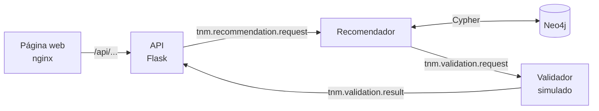

# Proyecto Biomedicos

Aplicación Flask+Neo4j para consultoría de estadios oncológicos (TNM), pruebas recomendadas y opciones de tratamiento para cáncer de mama.

## Resumen Rápido

| Aspecto          |    Detalle                                           |
|------------------|------------------------------------------------------|
| **Stack**        | Flask 3.0 + Neo4j 5 + RabbitMQ + nginx + Bootstrap 5 |
| **Lenguajes**    | Python (backend), JavaScript/HTML5 (frontend)        |
| **Base Datos**   | Neo4j (graph database)                               |
| **Mensajería**   | RabbitMQ (message broker) - Comunicación asíncrona   |
| **Ejecución**    | Docker Compose (Windows, Linux o macOS)              |
| **Python**       | 3.11 (incluido en la imagen Docker)                  |

## Arquitectura

Cada consulta de la página pasa por un **pipeline de microservicios** que se comunican a través de **RabbitMQ**:



1. La página envía la consulta (valores TNM y datos del paciente) a la API, a través de nginx, y recibe un identificador de trabajo.
2. La API publica el trabajo en RabbitMQ.
3. El **recomendador** consulta en Neo4j los estadios, pruebas y tratamientos de esa combinación TNM, y excluye los tratamientos quirúrgicos si la paciente no desea cirugía.
4. El **validador** evalúa cada tratamiento. Es un **validador simulado** (regla por palabras clave); sustituirlo por un modelo de aprendizaje automático es trabajo futuro.
5. La API recibe el resultado y la página, que la consulta cada 2 segundos, lo muestra.

Si el pipeline falla o no responde en 60 segundos, la página **no muestra tratamientos**: indica que no se pudo completar la evaluación y sugiere reintentar. Así, todo tratamiento que se muestra ha pasado por el recomendador y el validador.

### Servicios

| Servicio | Puerto | Función | Tecnología |
|----------|--------|---------|------------|
| **frontend** | 5500 | Sirve la página y reenvía `/api/...` a la API | nginx |
| **api** | 5000 | Recibe las consultas, publica los trabajos y entrega los resultados | Python, Flask, Waitress |
| **recommender** | — | Consulta Neo4j y genera las recomendaciones | Python, driver de Neo4j |
| **ml-validator** | — | Valida los tratamientos (simulado) | Python |
| **seed** | — | Valida y carga los CSV en Neo4j al arrancar | Python |
| **rabbitmq** | 5672 / 15672 | Mensajería entre servicios | RabbitMQ 3 |
| **neo4j** | 7474 / 7687 | Base de datos de grafos | Neo4j 5 |

Ver [MICROSERVICIOS.md](docs/MICROSERVICIOS.md) para el detalle del flujo, las colas y los mensajes, y [DIAGRAMAS.md](docs/DIAGRAMAS.md) para los diagramas.

## Instalación

El proyecto se ejecuta completo con Docker Compose: no hace falta instalar Python, Neo4j ni Node.js.

**Requisitos:**
- [Docker Desktop](https://www.docker.com/products/docker-desktop) (en Windows usa WSL2), con al menos 4 GB de RAM asignados.
- Git.
- Unos 2 GB de disco para las imágenes.
- Conexión a internet: la primera vez se descargan las imágenes, y la página carga Bootstrap, jQuery, Toastr y Font Awesome desde CDN.

**Pasos:**
```powershell
git clone https://github.com/EduardoCN1/biomedicos.git
cd biomedicos
docker compose up -d --build
```

La primera vez tarda unos minutos. Compose construye la imagen del proyecto, espera a que Neo4j y RabbitMQ estén listos y el servicio `seed` carga los datos de `data/*.csv` en Neo4j automáticamente.

Cuando termine, abre **http://localhost:5500**.

| Servicio | Dirección | Credenciales |
|----------|-----------|--------------|
| Aplicación web | http://localhost:5500 | — |
| API | http://localhost:5000 (también http://localhost:5500/api) | — |
| Neo4j Browser | http://localhost:7474 | `neo4j` / `password` (o los de tu `.env`) |
| RabbitMQ (administración) | http://localhost:15672 | `guest` / `guest` |

La aplicación web también se puede abrir desde otro equipo de la red, en `http://<IP-de-este-equipo>:5500`, si el cortafuegos permite el acceso a ese puerto.

El archivo `.env` es opcional; solo hace falta para cambiar la contraseña de Neo4j o los puertos de la aplicación web y de la API (ver [Variables de Entorno](#variables-de-entorno)).

Ver [DOCKER.md](docs/DOCKER.md) para la guía completa.

## Uso Diario

```powershell
docker compose up -d            # Arrancar (los datos de Neo4j se conservan entre arranques)
docker compose down             # Detener
docker compose logs -f          # Ver los registros de todos los servicios
docker compose ps               # Ver el estado de los servicios
```

Al aplicar cambios:
- **Frontend** (`frontend/`): basta con recargar el navegador.
- **Backend o microservicios** (`backend/`, `services/`, `scripts/`, `requirements.txt`): `docker compose up -d --build`.
- **Configuración de nginx** (`nginx/default.conf`): `docker compose restart frontend`.

## Estructura de Carpetas

Ver [ARCHITECTURE.md](docs/ARCHITECTURE.md) para detalle completo.
```
biomedicos/
├── backend/                 # API Flask (servida con Waitress)
│   ├── api.py
│   ├── config.py
│   ├── run_waitress.py
│   └── __init__.py
├── services/                # Microservicios que consumen de RabbitMQ
│   ├── recommender_service.py
│   └── ml_validator_service.py
├── frontend/                # HTML + JavaScript + CSS (servido con nginx)
│   ├── index.html
│   ├── css/
│   ├── js/
│   └── modals/
├── nginx/
│   └── default.conf         # Sirve frontend/ y reenvía /api/ a la API
├── data/                    # Datos de Neo4j
│   ├── nodos.csv
│   └── relaciones.csv
├── scripts/
│   ├── import_csv.py        # Valida y carga los CSV en Neo4j (lo ejecuta el servicio seed)
│   └── test-pipeline.ps1    # Prueba de extremo a extremo del pipeline
├── tests/
│   └── test_api.py
├── docs/                    # Documentación
├── docker-compose.yml       # Definición de todos los servicios
├── Dockerfile               # Imagen de la API y los microservicios
├── .env.example
├── requirements.txt
├── requirements-dev.txt     # Dependencias de los tests (pytest)
└── README.md
```

### Novedades v2.4 (Octubre 2026)
- **Instalación solo con Docker**: un comando levanta todo; los datos se validan y se cargan automáticamente.
- **Frontend servido por nginx**, que reenvía `/api/...` a la API: sin URL ni puerto fijos en el JavaScript.
- **Pipeline más robusto**: reintentos al consultar Neo4j y aviso inmediato cuando falla un microservicio.
- **Sin resultados sin evaluar**: si el pipeline falla, la página muestra un error en lugar de tratamientos no validados (se elimina el modo degradado).
- **Datos corregidos**: etiquetas siempre como texto y errata "Endocrine Therapy".
- **Documentación reescrita** a partir del sistema real.

### Novedades v2.3 (Mayo 2026)
- **Pipeline de microservicios** con RabbitMQ: API → recomendador → validador.
- **Validador simulado**, preparado para sustituirlo por un modelo de ML.
- **Preferencia de cirugía** en la consulta.
- **Docker Compose** para todos los servicios.

### Novedades v2.2 (Marzo 2026)
- **Reestructuración Frontend**: CSS, JS y modales en archivos separados
- **Interfaz Mejorada**: Diseño moderno con animaciones y validaciones
- **Modales en archivos separados**, cargados al abrir la página
- **Better UX**: Spinner de carga, notificaciones, perfil en tiempo real

Ver el [CHANGELOG](CHANGELOG.md) para el detalle de cada versión.

## Documentación Completa

Consulte la documentación apropiada según su caso de uso:

  - **[DOCKER.md](docs/DOCKER.md)** - Instalación y uso del proyecto con Docker Compose
  - **[MICROSERVICIOS.md](docs/MICROSERVICIOS.md)** - Pipeline de microservicios, colas, mensajes y modelo de datos
  - **[API.md](docs/API.md)** - Referencia de endpoints con respuestas reales
  - **[DATABASE.md](docs/DATABASE.md)** - Datos de Neo4j: formato, carga, copias de seguridad
  - **[ARCHITECTURE.md](docs/ARCHITECTURE.md)** - Estructura, flujos, configuración y dependencias
  - **[DIAGRAMAS.md](docs/DIAGRAMAS.md)** - Diagramas Mermaid de arquitectura
  - **[TROUBLESHOOTING.md](docs/TROUBLESHOOTING.md)** - Solución de problemas
  - **[REESTRUCTURACION_FRONTEND.md](docs/REESTRUCTURACION_FRONTEND.md)** - Registro histórico de la reestructuración del frontend (v2.2)

## Endpoints Disponibles

  Accesibles en `http://localhost:5000` o, a través del proxy, en `http://localhost:5500/api`.

  | Método | Ruta | Descripción |
  |--------|------|-------------|
  | GET | `/` | Comprobación de que la API está en marcha |
  | GET | `/labels/t`, `/labels/n`, `/labels/m` | Valores T, N y M disponibles |
  | GET | `/get_stage_info?t_label=T2&n_label=N1&m_label=M0` | Consulta directa de estadios, pruebas y tratamientos |
  | POST | `/pipeline/submit` | Envía una consulta al pipeline de microservicios |
  | GET | `/pipeline/result/<job_id>` | Estado y resultado de una consulta del pipeline |
  | GET | `/pipeline/health` | Estado de RabbitMQ y del consumidor de resultados |
  | GET | `/pipeline/debug` | Todos los trabajos en memoria (depuración) |
  | POST | `/entradas` | Devuelve el JSON recibido (la página no lo usa) |

  >**Ver** [API.md](docs/API.md) **para parámetros, ejemplos y respuestas.**

## Variables de Entorno

  El archivo `.env` es **opcional**: sin él se usan los valores por defecto. Para personalizarlo, copia la plantilla y edítala:

  ```powershell
  cp .env.example .env
  ```

  | Variable | Por defecto | Uso |
  |----------|-------------|-----|
  | `NEO4J_USER` | `neo4j` | Usuario de Neo4j |
  | `NEO4J_PASSWORD` | `password` | Contraseña de Neo4j (mínimo 8 caracteres) |
  | `FRONTEND_PORT` | `5500` | Puerto de la aplicación web en tu equipo |
  | `API_PORT` | `5000` | Puerto de la API en tu equipo, para pruebas directas (la página usa `/api`) |

  El resto de la configuración (URIs, colas de RabbitMQ y demás puertos) está fijada en `docker-compose.yml`.

  **Notas:**
  - La contraseña de Neo4j solo se aplica la primera vez que se crea su volumen. Si la cambias después, recrea el volumen con `docker compose down -v` (los datos se vuelven a cargar desde los CSV).
  - No commitear `.env` a Git (contiene credenciales).

## Tests

  ```powershell
  # Tests de la API (con el proyecto levantado; usan Neo4j con datos)
  docker compose run --rm api python -m pytest tests -v

  # Prueba de extremo a extremo del pipeline (PowerShell)
  .\scripts\test-pipeline.ps1
  ```

## Gestión de Datos Neo4j

  Los datos se cargan solos: al levantar el proyecto, el servicio `seed` importa `data/nodos.csv` y `data/relaciones.csv` si Neo4j está vacío. Si ya tiene datos, no hace nada.

  Para volver a cargarlos desde cero (por ejemplo, después de editar los CSV):

  ```powershell
  docker compose down -v      # Borra el volumen de Neo4j
  docker compose up -d
  ```

  > **Ver [DATABASE.md](docs/DATABASE.md)** para copias de seguridad, restauración y consultas de verificación.

## Desarrollo

  ### Agregar nuevo endpoint

  Editar `backend/api.py`:

  ```python
  @app.route('/mi_endpoint', methods=['GET'])
  def mi_endpoint():
      # Tu lógica aquí
      return {'resultado': 'OK'}, 200
  ```

  Después, reconstruir: `docker compose up -d --build`. El endpoint queda disponible también en `/api/mi_endpoint` a través del proxy, sin cambiar nginx.

  ### Modificar frontend

  Editar `frontend/index.html` y `frontend/js/entradas.js`, y recargar el navegador. Las llamadas a la API usan la constante `API_URL` (`'/api'`), definida en `entradas.js`:

  ```javascript
  // entradas.js - Añadir función AJAX
  function miFunc() {
      $.ajax({
          url: `${API_URL}/mi_endpoint`,
          ...
      });
  }
  ```

  ### Agregar dependencias

  Editar `requirements.txt` (o `requirements-dev.txt` para herramientas de test) y reconstruir:
  ```powershell
  docker compose up -d --build
  ```

## Solucionar Problemas

  ### Un puerto ya está en uso
  - **Aplicación web (5500) o API (5000):** cambia `FRONTEND_PORT` o `API_PORT` en `.env` y vuelve a ejecutar `docker compose up -d`. En macOS, el 5000 suele estar ocupado por el Receptor AirPlay.
  - **Otros puertos (5672, 7474, 7687, 15672):** libera el puerto cerrando el programa que lo usa.

  ### "Cannot connect to the Docker daemon"
  Docker Desktop no está abierto. Ábrelo, espera a que indique que está en ejecución y repite el comando.

  ### La página carga pero no muestra tratamientos
  - Si aparece el aviso **«No se pudo completar la evaluación»**, el pipeline no terminó la consulta y la página no muestra tratamientos sin evaluar (ver [problema 7 de TROUBLESHOOTING](docs/TROUBLESHOOTING.md#7-aviso-no-se-pudo-completar-la-evaluación-en-la-página)).
  - Comprueba que todos los servicios estén en marcha: `docker compose ps -a` (`seed` debe aparecer como `Exited (0)`).
  - Revisa los registros: `docker compose logs api recommender ml-validator`.

  > **Ver** [TROUBLESHOOTING.md](docs/TROUBLESHOOTING.md) **para más soluciones.**

## Próximas Mejoras
- [ ] Modelo de ML real para el validador (hoy es simulado)
- [ ] Guardar los trabajos del pipeline fuera de memoria (por ejemplo, Redis)
- [ ] Autenticación JWT
- [ ] Más tests (pipeline y frontend)
- [ ] CI/CD (GitHub Actions)
- [ ] Frontend React/Vue


## Contacto y Licencia
Proyecto de práctica sobre arquitectura de software biomedico.

**No apto para uso clínico:** el validador de tratamientos es simulado y los datos no constituyen una guía de estadificación completa.

---
**Última actualización:** 2026-10-07
**Versión:** 2.4 (Instalación con Docker + pipeline más robusto)
