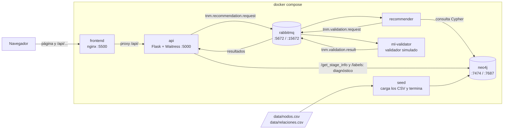
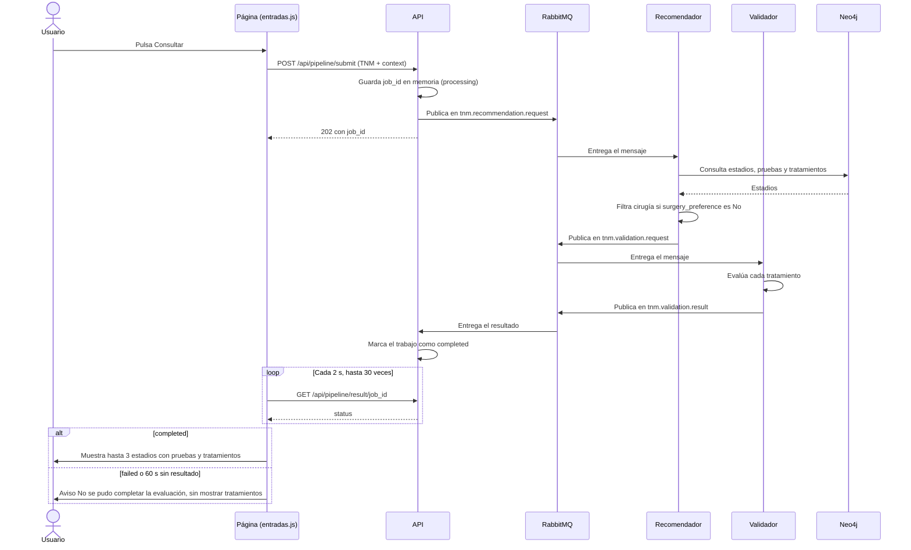
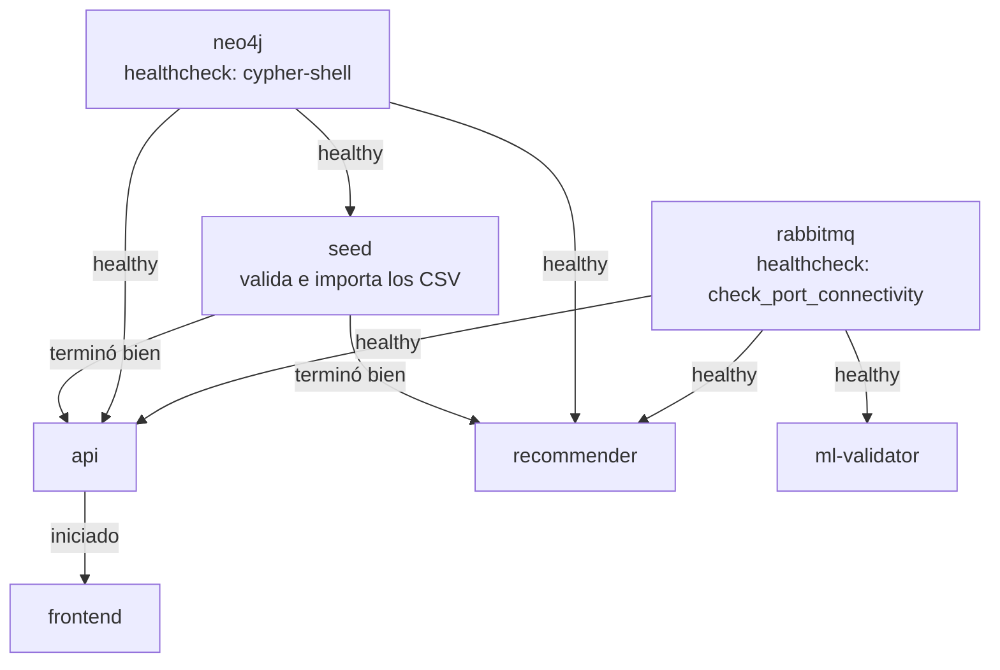
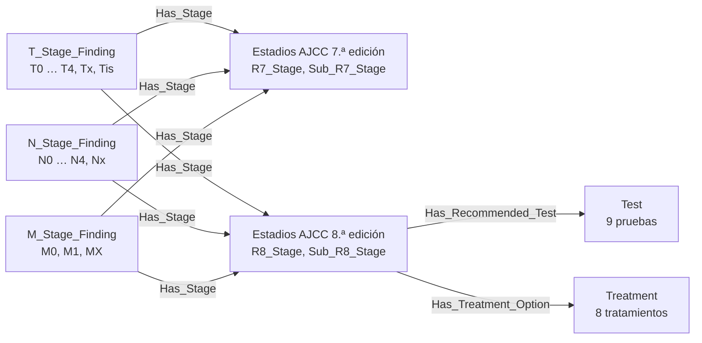

# Diagramas de Arquitectura

Diagramas en [Mermaid](https://mermaid.js.org/). GitHub los dibuja directamente al ver este archivo; en VS Code, con una extensión de vista previa de Mermaid. Para modificarlos basta con editar el código de cada bloque: no hay imágenes aparte que mantener.

## Servicios y Comunicación

Desde otros equipos de la red solo es accesible `frontend` (:5500). Los puertos de `api`, `rabbitmq` y `neo4j` se publican en `127.0.0.1`: solo responden en el propio servidor.

## Secuencia de una Consulta

Si el recomendador o el validador fallan, publican un aviso en `tnm.validation.result` y el trabajo pasa a `failed` sin esperar los 60 s.

## Orden de Arranque

Este orden se aplica con `docker compose up`. Cuando Docker arranca por su cuenta (al encender el equipo), levanta los servicios sin orden y estos reintentan la conexión hasta que Neo4j y RabbitMQ están listos; `seed` no se ejecuta.

## Modelo de Datos

Solo los nodos y relaciones que usan las consultas (ver [MICROSERVICIOS.md](MICROSERVICIOS.md#modelo-de-datos-en-neo4j)).

La consulta devuelve los estadios a los que apuntan a la vez los valores T, N y M elegidos y que tienen pruebas y tratamientos, es decir, solo estadios de la 8.ª edición.
