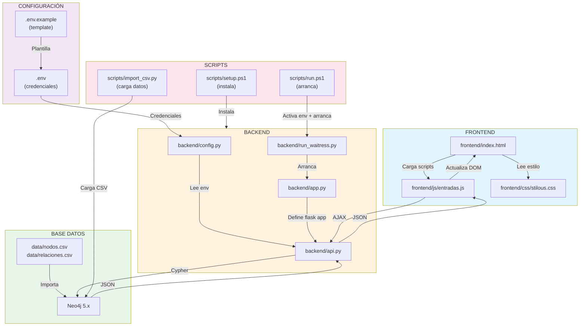
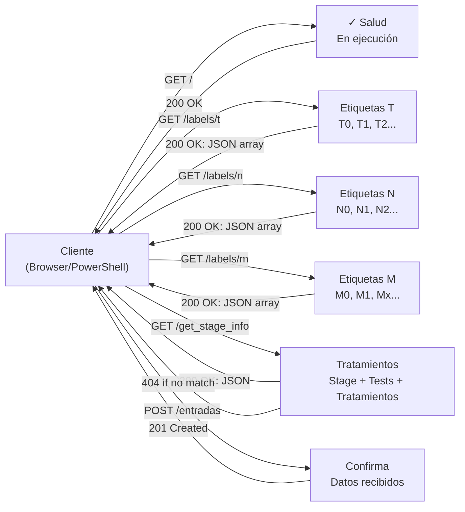
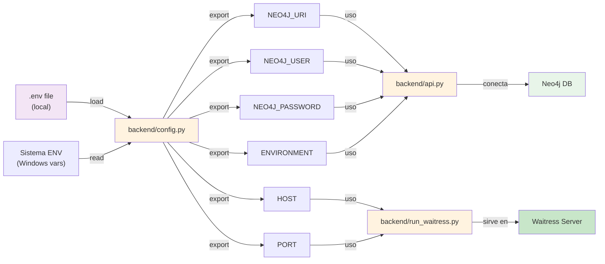
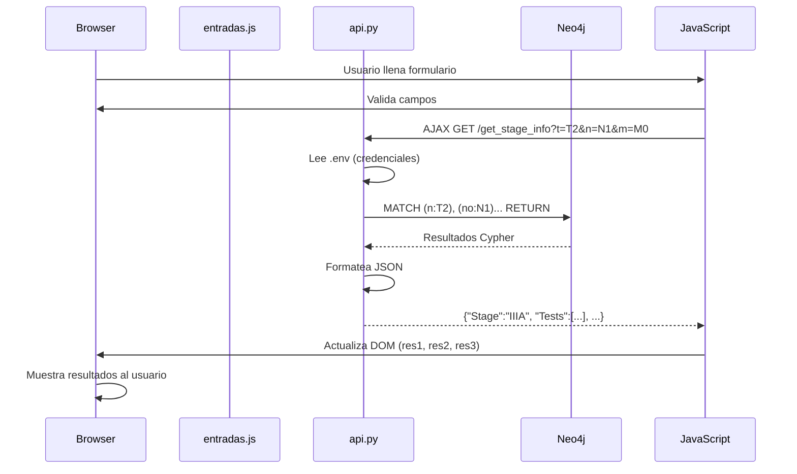
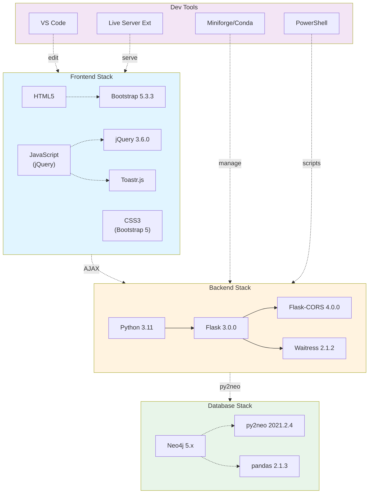

# Diagrama de Arquitectura
# Editar codigo mermaid segun modificacinoes realizadas respecto al proyecto y generar un nuevo .SVG en https://mermaid.ai/web/ y remplazar en carpeta docs/diagramas_svg
## Flujo de Datos General

## Diagrama de Endpoints

## Estructura de Carpetas Completa

```mermaid
graph TD
    Root[" biomedicos/"]
    
    Root -->|Documentación| README[" README.md"]
    Root -->|Dependencias| Req[" requirements.txt"]
    Root -->|Configuración| Env[" .env.example"]
    Root -->|Git| GitIgnore[" .gitignore"]
    
    Root -->|Backend| Backend[" backend/"]
    Backend --> BInit["__init__.py"]
    Backend --> BConfig["config.py"]
    Backend --> BAPI["api.py"]
    Backend --> BApp["app.py"]
    Backend --> BWaitress["run_waitress.py"]
    
    Root -->|Frontend| Frontend[" frontend/"]
    Frontend --> FIndex["index.html"]
    Frontend --> FJS[" js/"]
    FJS --> FEntradas["entradas.js"]
    FJS --> FConfig["config.js"]
    Frontend --> FCSS[" css/"]
    FCSS --> FCss["stilous.css"]
    FCSS --> FScss["stilous.scss"]
    
    Root -->|Datos| Data[" data/"]
    Data --> DNodos["nodos.csv"]
    Data --> DRel["relaciones.csv"]
    Data --> DBackup[" backups/"]
    
    Root -->|Scripts| Scripts[" scripts/"]
    Scripts --> SSetup["setup.ps1"]
    Scripts --> SRun["run.ps1"]
    Scripts --> SImport["import_csv.py"]
    
    Root -->|Tests| Tests[" tests/"]
    Tests --> TTest["test_api.py"]
    
    Root -->|Documentación| Docs[" docs/"]
    Docs --> DArch["ARCHITECTURE.md"]
    Docs --> DAPI["API.md"]
    Docs --> DSetup["SETUP.md"]
    Docs --> DEstado["ESTADO_FINAL.md"]
    
    style Root fill:#fff9c4
    style Backend fill:#fff3e0
    style Frontend fill:#e1f5ff
    style Data fill:#e8f5e9
    style Scripts fill:#fce4ec
    style Tests fill:#f1f8e9
    style Docs fill:#f3e5f5
```

## Proceso de Deployment

```mermaid
graph LR
    A[" Developer"] -->|Clone repo| B[" Clonar proyecto"]
    B -->|Ejecutar| C["▶ scripts/setup.ps1"]
    C -->|Instala| D[" Conda + Dependencias"]
    D -->|Copiar| E[" .env.example → .env"]
    E -->|Editar| F[" Credenciales Neo4j"]
    F -->|Ejecutar| G["▶ scripts/run.ps1"]
    G -->|Carga env| H[" Variables de entorno"]
    H -->|Arranca| I[" Waitress en :5000"]
    I -->|Frontend abre| J[" Live Server en :5500"]
    J -->|AJAX| I
    I -->|Cypher| K[" Neo4j"]
    K -->|JSON| I
    I -->|JSON| J
    J -->|Muestra| L[" Resultados"]
    
    style A fill:#c8e6c9
    style C fill:#fce4ec
    style G fill:#fce4ec
    style I fill:#fff3e0
    style K fill:#e8f5e9
    style L fill:#c8e6c9
```

## Variables de Entorno (Config Flow)

## Ciclo de Requeste (Ejemplo)

## Stack Tecnológico

